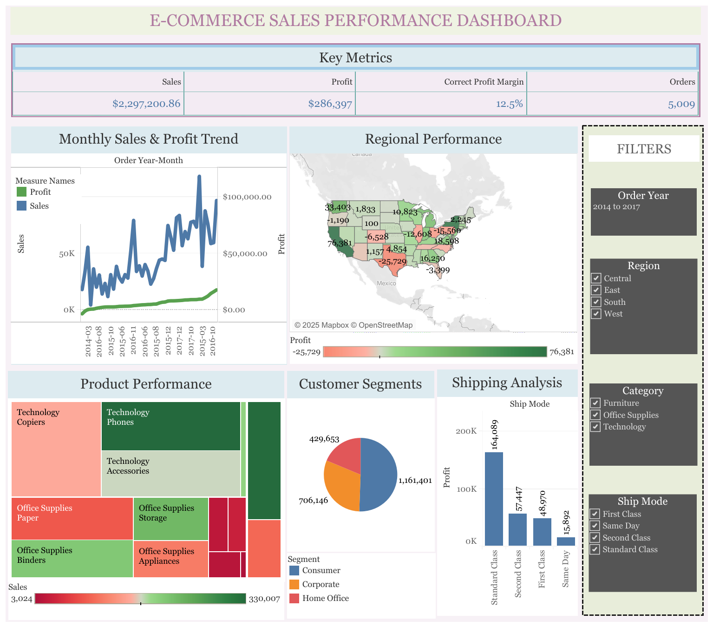

# 🏪 E-commerce Sales Performance Analysis



## 📊 Project Overview
This project analyzes 4 years of sales data from a global superstore to uncover key business insights, identify profitability drivers, and provide data-driven recommendations for business optimization. The analysis covers sales trends, regional performance, product profitability, and customer behavior.

**🔗 Live Dashboard:** [View Interactive Tableau Dashboard](https://public.tableau.com/views/E-COMMERCESALESPERFORMANCEDASHBOARD/E-COMMERCESALESPERFORMANCEDASHBOARD)

## 🎯 Business Objectives
- Identify top-performing products and regions with highest profitability
- Analyze factors affecting profit margins and sales performance  
- Provide actionable insights to optimize business strategy
- Develop interactive dashboard for ongoing business monitoring

## 📁 Dataset
- **Source:** Global Superstore dataset
- **Records:** 9,994 transactions | **Period:** 2014-2017
- **Key Metrics:** Sales, Profit, Quantity, Discounts, Shipping
- **Data Quality:** No missing values, required date conversion and feature engineering

## 🛠️ Technical Stack
- **Data Analysis:** Python, Pandas, NumPy
- **Visualization:** Matplotlib, Seaborn, Tableau
- **Environment:** Google Colab, Jupyter Notebook
- **Tools:** GitHub, Tableau Public

## 📈 Key Insights

### 🚀 Positive Performance
- **$2.29M total sales** with **$286K profit** (12.5% margin)
- **Technology category dominance:** Phones ($330K sales), Copiers (37.2% margin)
- **West region** leading with 21.9% profit margin ($76K profit)
- **Standard shipping** most profitable ($164K profit)

### ⚠️ Critical Issues Identified
- **Central region operating at loss** (-$25,729 profit)
- **18.7% of orders** generate negative profit
- **High discount rates** (48% avg) on loss-making orders vs 8% on profitable ones
- **Furniture category** struggling with profitability

## 💡 Business Recommendations

### Immediate Actions (Quarter 1)
1. **Implement discount caps** (max 20-25%) for problematic products
2. **Audit Central region operations** and pricing strategy
3. **Review customer relationships** with consistent negative margins

### Strategic Initiatives (Quarter 2-4)
1. **Expand Technology product lines** based on high margin performance
2. **Replicate West region strategies** across other regions
3. **Develop customer loyalty program** for high-value segments


## 🚀 Installation & Usage

### Prerequisites

- Python 3.8+ installed
- Jupyter Notebook or JupyterLab (or Google Colab for cloud execution)
- `git` (optional, for cloning the repository)

### Installation

Clone the repository and install dependencies:

```bash
git clone https://github.com/khushi-malviya/E-Commerce-Sales-Analysis.git
cd ecommerce-sales-analysis
pip install -r requirements.txt
```

### Running the analysis

Start Jupyter Notebook and open the analysis notebook:

```bash
jupyter notebook
# then open `superstore_analysis.ipynb` in your browser and run the cells
```

Alternatively, open the notebook in Google Colab by uploading the `.ipynb` or using the GitHub import feature.

Note: Raw data is in the `data/raw/` folder; processed data outputs are in `data/processed/`.

## 📊 Dashboard Features
- Interactive filters for year, region, and product category

- Real-time performance metrics and KPI tracking

- Regional analysis with geographic visualization

- Product performance breakdown with profitability insights

- Customer segmentation and shipping mode analysis

## 🎓 Skills Demonstrated
- Data Cleaning & Preprocessing

- Exploratory Data Analysis (EDA)

- Data Visualization & Dashboard Creation

- Business Intelligence & Insight Generation

- Statistical Analysis & Trend Identification

- Python Programming & Data Manipulation

## 🔗 Connect
LinkedIn: https://www.linkedin.com/in/khushi-malviya-72308a20b/

Email: khushimalviya11054@gmail.com


